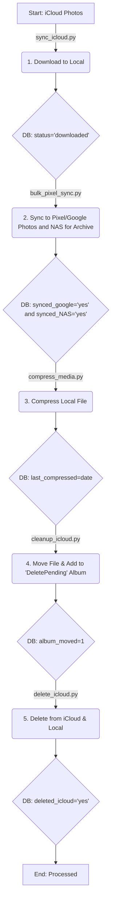

# Full Media Backup & Management Pipeline

## 1. Project Objective

This project is an automated pipeline for managing a personal media library. Its primary goals are:
1.  **Download**: Securely pull all photos and videos from iCloud.
2.  **Backup**: Sync all media to Google Photos for a permanent, cloud-based backup (leveraging a Pixel device for original quality uploads) and sync to NAS folder also for archival so we have 2 copies of the media. One in cloud and one locally available.
3.  **Optimize**: Apply tiered compression to local files based on their age to save storage space. this will be configuration based and can be configured easily.
4.  **Cleanup**: Safely delete the original files from iCloud after they have been backed up and processed, freeing up iCloud storage.

A central SQLite database (`media.db`) acts as the single source of truth, tracking the state of each media file as it moves through the pipeline.

---

## 2. System Architecture & Workflow

The pipeline is a series of stages, each executed by a dedicated Python script. Files transition through various statuses recorded in the `media.db` database.

### Directory Structure

-   `/mnt/wd_all_pictures/incoming`: Landing zone for new files from iCloud.
-   `/mnt/wd_all_pictures/backup`: Stores files that needs to be synced with Pixel and NAS and have been backed up.
-   `/mnt/wd_all_pictures/compress`: Stores files that needs to be compressed.
-   `/mnt/wd_all_pictures/delete_pending`: A temporary holding area for files that are ready for deletion from iCloud.

---

## 3. Database Schema (`media.db`)

The `media` table tracks the lifecycle of each file.

| Column           | Type    | Description                                                              |
| ---------------- | ------- | ------------------------------------------------------------------------ |
| `id`             | INTEGER | Primary Key.                                                             |
| `filename`       | TEXT    | The original filename of the media.                                      |
| `icloud_id`      | TEXT    | Unique ID from iCloud (used as filename if real ID is unavailable).      |
| `created_date`   | TEXT    | The creation date of the media file (ISO format).                        |
| `local_path`     | TEXT    | The current absolute path to the file on the local system.               |
| `status`         | TEXT    | Initial status, e.g., 'downloaded'.                                      |
| `synced_google`  | TEXT    | Flag ('yes' or NULL) indicating if the file is backed up to Google Photos. |
| `album_moved`    | INTEGER | Flag (1 or 0) indicating if the file has been moved to the iCloud 'DeletePending' album. |
| `deleted_icloud` | TEXT    | Flag ('yes' or NULL) indicating if the file has been deleted from iCloud. |
| `initial_size`   | INTEGER | File size in bytes before any compression.                               |
| `current_size`   | INTEGER | File size in bytes after compression.                                    |
| `last_compressed`| TEXT    | Timestamp of the last compression operation.                             |
| `last_updated`   | TEXT    | Timestamp of the last update to the record.                              |

---

## 4. Pipeline Scripts & Execution Order

The scripts are designed to be run in the following sequence.

### Stage 1: `sync_icloud.py`

*   **Purpose**: Downloads new media from iCloud to the `incoming` directory.
*   **Action**:
    1.  Runs the `icloudpd` command-line tool.
    2.  Scans the download directory for new files.
    3.  Adds a record for each new file to the `media` table with `status='downloaded'`.
*   **Prerequisites**: `icloudpd` installed, `config.yaml` with iCloud credentials.

### Stage 2: `bulk_pixel_sync.py`

*   **Purpose**: Marks files as backed up to Google Photos. It relies on `Syncthing` to move files from the server to the Pixel device. 
*   **Action**:
    1.  Connects to the Syncthing API on the Pixel device.
    2.  Fetches a list of files that are fully synced.
    3.  Updates the `media` table, setting `synced_google='yes'` for matching filenames.
    4.  (Optional) Deletes the file from the Pixel device's local storage to save space.
*   **Prerequisites**: Syncthing running on server and Pixel, Syncthing API key.
### Stage 3: `bulk_nas_sync.py`

*   **Purpose**: Marks files as backed up to NAS.  
*   **Action**:
    1. Updates the `media` table, setting `nas_google='yes'` for matching filenames.
*   **Prerequisites**: 
### Stage 4: `compress_media.py`

*   **Purpose**: Compresses local media files that have been successfully backed up to Google Photos and NAS.
*   **Action**:
    1.  Selects files where `synced_google='yes' && nas_google='yes'`.
    2.  Applies tiered compression based on the media's age:
        *   **< 1 year old**: Light compression.
        *   **1-3 years old**: Medium compression.
        *   **> 3 years old**: Heavy compression.
    3.  Updates the `initial_size` (if not set) and `current_size` in the database.
*   **Prerequisites**: `ffmpeg` and `Pillow` library installed.

### Stage 4: `cleanup_icloud.py`

*   **Purpose**: Prepares files for deletion from iCloud.
*   **Action**:
    1.  Selects files where `synced_google='yes'` and `album_moved=0`.
    2.  Moves the local file from `incoming` -> `processed` -> `delete_pending`.
    3.  Connects to iCloud and adds the photo to the `DeletePending` album.
    4.  Updates the `media` table, setting `album_moved=1`.
*   **Prerequisites**: iCloud credentials.

### Stage 5: `delete_icloud.py`

*   **Purpose**: Performs the final cleanup by deleting files from iCloud and the local `delete_pending` directory.
*   **Action**:
    1.  Selects files where `album_moved=1` and `deleted_icloud` is NULL.
    2.  Connects to iCloud and iterates through the `DeletePending` album.
    3.  Deletes each matching photo from the album.
    4.  Deletes the corresponding local file from the `delete_pending` directory.
    5.  Updates the `media` table, setting `deleted_icloud='yes'`.
*   **Prerequisites**: iCloud credentials.

---

## 5. Configuration

-   **`config.yaml`**: Used by `sync_icloud.py` for iCloud credentials and download settings.
-   **Environment Variables**: Passwords and API keys should be stored as environment variables or in a `.env` file rather than hardcoded.
-   **Constants**: Each script contains a "Config" section at the top for paths, album names, and other settings.

---

## 6. Future Enhancements & Notes

-   **Scheduler**: Use `cron` or a similar scheduler to run the pipeline scripts automatically in sequence (e.g., nightly).
-   **Error Handling**: Improve retry logic and notifications for script failures.
-   **Refactoring**: Consolidate shared functions (database connections, iCloud login) into a common utility module to reduce code duplication.
-   **Alternative Downloader**: The `icloud_downloader.py` script provides an alternative, more integrated approach to downloading and database management, which could be merged into the main pipeline. It uses a more normalized database schema.

This `README.md` should serve as an excellent foundation for our work on this project. Let me know what you'd like to tackle next!

<!--
[PROMPT_SUGGESTION]Refactor the database and iCloud login functions into a shared utility module to reduce code duplication across the scripts.[/PROMPT_SUGGESTION]
[PROMPT_SUGGESTION]Create a master script or a simple scheduler to run the entire pipeline in the correct order.[/PROMPT_SUGGESTION]
