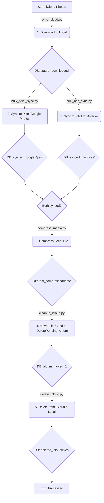

# Enhanced Media Backup & Management Pipeline

## 🚀 Overview

This project is a comprehensive, automated pipeline for managing a personal media library with enhanced error handling, modular architecture, and robust configuration management. The system provides secure backup, optimization, and cleanup of media files across multiple storage systems.

## ✨ Key Features

- **Modular Architecture**: Separate modules for each pipeline stage
- **Centralized Configuration**: YAML-based configuration with environment variable overrides
- **Comprehensive Error Handling**: Retry mechanisms, error tracking, and graceful failure handling
- **Enhanced Logging**: Structured logging with rotation and multiple output formats
- **Database Management**: SQLite database with proper schema and indexing
- **Authentication Management**: Centralized authentication for iCloud and Syncthing
- **Pipeline Orchestration**: Automated execution of all stages in sequence
- **Testing Framework**: Built-in testing and validation capabilities

## 🏗️ System Architecture

The pipeline consists of six main stages, each implemented as a separate module:



## 📁 Project Structure

```
media-storage/
├── common/                     # Shared modules
│   ├── __init__.py            # Package initialization
│   ├── config.py              # Configuration management
│   ├── logger.py              # Logging system
│   ├── database.py            # Database operations
│   └── auth.py                # Authentication management
├── sync_icloud.py             # iCloud download module
├── bulk_pixel_sync.py         # Pixel/Google Photos sync
├── bulk_nas_sync.py           # NAS synchronization
├── compress_media.py          # Media compression
├── cleanup_icloud.py          # iCloud cleanup preparation
├── delete_icloud.py           # Final deletion
├── pipeline_orchestrator.py   # Main pipeline coordinator
├── test_pipeline.py           # Testing and validation
├── config.yaml                # Configuration file
├── requirements.txt           # Python dependencies
├── media_db.py                # Legacy database module (deprecated)
├── sync_pixel.py              # Legacy pixel sync (deprecated)
└── README_ENHANCED.md         # This file
```

## 🗄️ Enhanced Database Schema

The `media` table now includes comprehensive tracking:

| Column           | Type    | Description                                                              |
|------------------|---------|--------------------------------------------------------------------------|
| `id`             | INTEGER | Primary Key                                                              |
| `filename`       | TEXT    | Original filename of the media                                           |
| `icloud_id`      | TEXT    | Unique ID from iCloud                                                    |
| `created_date`   | TEXT    | Creation date (ISO format)                                               |
| `local_path`     | TEXT    | Current absolute path to the file                                        |
| `status`         | TEXT    | Current status (e.g., 'downloaded')                                      |
| `synced_google`  | TEXT    | Flag indicating Google Photos backup status                              |
| `synced_nas`     | TEXT    | Flag indicating NAS backup status                                        |
| `album_moved`    | INTEGER | Flag indicating if moved to delete pending album                         |
| `deleted_icloud` | TEXT    | Flag indicating iCloud deletion status                                   |
| `initial_size`   | INTEGER | Original file size in bytes                                              |
| `current_size`   | INTEGER | Current file size after compression                                      |
| `last_compressed`| TEXT    | Timestamp of last compression                                            |
| `error_count`    | INTEGER | Number of processing errors                                              |
| `last_error`     | TEXT    | Last error message                                                       |
| `last_updated`   | TEXT    | Last update timestamp                                                    |
| `created_at`     | TEXT    | Record creation timestamp                                                |

## ⚙️ Configuration

### Environment Variables

Set these environment variables for sensitive data:

```bash
export ICLOUD_USERNAME="your_icloud_email@example.com"
export ICLOUD_PASSWORD="your_icloud_password"
export SYNCTHING_API_KEY="your_syncthing_api_key"
export DB_FILE="path/to/your/media.db"
```

### Configuration File (config.yaml)

```yaml
# Database configuration
database:
  file_path: "media.db"
  backup_enabled: true
  backup_interval_hours: 24

# iCloud configuration
icloud:
  username: ""  # Set via environment variable
  password: ""  # Set via environment variable
  directory: "/mnt/wd_all_pictures/incoming"
  days: 0  # Download files from last N days (0 = all)
  album_name: "DeletePending"

# Syncthing configuration
syncthing:
  api_key: ""  # Set via environment variable
  base_url: "http://192.168.1.118:8384/rest"
  folder_id: "default"
  pixel_local_folder: "/storage/emulated/0/DCIM/Syncthing"
  delete_local_pixel: true
  timeout_seconds: 30
  max_retries: 3

# NAS configuration
nas:
  mount_path: "/mnt/nas_backup"
  sync_enabled: true
  delete_after_sync: false

# Compression configuration
compression:
  enabled: true
  light_quality: 85    # < 1 year old
  medium_quality: 75   # 1-3 years old
  heavy_quality: 65    # > 3 years old
  light_crf: 26        # Video CRF < 1 year
  medium_crf: 28       # Video CRF 1-3 years
  heavy_crf: 30        # Video CRF > 3 years

# Logging configuration
logging:
  level: "INFO"
  log_dir: "logs"
  log_file: "media_pipeline.log"
  max_file_size_mb: 10
  backup_count: 5

# Directory structure
directories:
  incoming: "/mnt/wd_all_pictures/incoming"
  backup: "/mnt/wd_all_pictures/backup"
  compress: "/mnt/wd_all_pictures/compress"
  delete_pending: "/mnt/wd_all_pictures/delete_pending"
  processed: "/mnt/wd_all_pictures/processed"
```

## 🚀 Usage

### Installation

1. Install Python dependencies:
```bash
pip install -r requirements.txt
```

2. Install external tools:
```bash
# Install icloudpd for iCloud downloads
pip install icloudpd

# Install ffmpeg for video compression
# Ubuntu/Debian: sudo apt install ffmpeg
# macOS: brew install ffmpeg
# Windows: Download from https://ffmpeg.org/
```

3. Configure your settings in `config.yaml` and set environment variables.

### Running the Pipeline

#### Option 1: Run Complete Pipeline
```bash
python pipeline_orchestrator.py
```

#### Option 2: Run Specific Stages
```bash
python pipeline_orchestrator.py --stages icloud_sync pixel_sync nas_sync
```

#### Option 3: Dry Run (Test Mode)
```bash
python pipeline_orchestrator.py --dry-run
```

#### Option 4: Run Individual Modules
```bash
python sync_icloud.py          # Download from iCloud
python bulk_pixel_sync.py      # Sync to Pixel/Google Photos
python bulk_nas_sync.py        # Sync to NAS
python compress_media.py       # Compress media files
python cleanup_icloud.py       # Prepare for deletion
python delete_icloud.py        # Final deletion
```

### Pipeline Orchestrator Options

```bash
python pipeline_orchestrator.py --help

Options:
  --stages STAGES     Specific stages to run
  --dry-run          Perform a dry run without executing operations
  --list-stages      List available stages and exit
  --status           Show pipeline status and exit
  --validate         Validate environment and exit
```

### Testing and Validation

```bash
# Run comprehensive tests
python test_pipeline.py

# Validate environment
python pipeline_orchestrator.py --validate

# Check pipeline status
python pipeline_orchestrator.py --status
```

## 📊 Monitoring and Logging

### Log Files

- `logs/media_pipeline.log` - Main pipeline log
- `logs/sync_icloud.log` - iCloud sync operations
- `logs/bulk_pixel_sync.log` - Pixel sync operations
- `logs/bulk_nas_sync.log` - NAS sync operations
- `logs/compress_media.log` - Compression operations
- `logs/cleanup_icloud.log` - Cleanup operations
- `logs/delete_icloud.log` - Deletion operations

### Pipeline Statistics

The system tracks comprehensive statistics:
- Total files processed
- Files synced to Google Photos
- Files synced to NAS
- Files compressed
- Files moved to delete pending
- Files deleted from iCloud
- Error counts and recent activity

## 🔧 Advanced Features

### Error Handling and Retry Logic

- Automatic retry with exponential backoff
- Error counting and tracking
- Graceful failure handling
- Detailed error logging

### Database Management

- Automatic database initialization
- Backup creation
- Connection pooling
- Transaction management
- Performance indexing

### Authentication Management

- Centralized authentication for all services
- Connection validation
- Session management
- 2FA support for iCloud

### Configuration Management

- YAML-based configuration
- Environment variable overrides
- Configuration validation
- Hot-reload support

## 🛠️ Development

### Adding New Stages

1. Create a new module following the existing pattern
2. Implement a manager class with standard methods
3. Add the stage to `pipeline_orchestrator.py`
4. Update configuration schema if needed
5. Add tests

### Testing

```bash
# Run all tests
python test_pipeline.py

# Run specific module tests
python -m pytest tests/test_database.py
```

### Code Quality

The project follows Python best practices:
- Type hints throughout
- Comprehensive error handling
- Detailed logging
- Modular architecture
- Configuration-driven behavior

## 🔒 Security Considerations

- Credentials stored as environment variables
- No hardcoded passwords or API keys
- Secure file handling
- Database connection security
- Log file permissions

## 📈 Performance Optimization

- Database indexing for fast queries
- Batch processing for large file sets
- Connection pooling
- Efficient file operations
- Memory-conscious processing

## 🐛 Troubleshooting

### Common Issues

1. **iCloud Authentication Failed**
   - Check credentials in environment variables
   - Complete 2FA on device
   - Verify iCloud account status

2. **Syncthing Connection Failed**
   - Verify API key and URL
   - Check Syncthing service status
   - Confirm network connectivity

3. **Database Errors**
   - Check file permissions
   - Verify disk space
   - Review database integrity

4. **File Processing Errors**
   - Check file permissions
   - Verify external tool installation (ffmpeg, icloudpd)
   - Review log files for detailed errors

### Debug Mode

Enable debug logging by setting:
```yaml
logging:
  level: "DEBUG"
```

## 📝 Migration from Legacy System

If migrating from the original system:

1. Backup your existing `media.db`
2. The new system will automatically upgrade the database schema
3. Legacy modules (`media_db.py`, `sync_pixel.py`) are deprecated but functional
4. Update your configuration to use the new YAML format
5. Test with `--dry-run` before full execution

## 🤝 Contributing

1. Fork the repository
2. Create a feature branch
3. Make your changes
4. Add tests
5. Submit a pull request

## 📄 License

This project is licensed under the MIT License - see the LICENSE file for details.

## 🙏 Acknowledgments

- iCloudpd for iCloud integration
- Syncthing for file synchronization
- FFmpeg for media compression
- Python community for excellent libraries

---

**Note**: This enhanced version maintains backward compatibility while providing significant improvements in reliability, maintainability, and functionality. The modular architecture makes it easy to extend and customize for specific needs.
